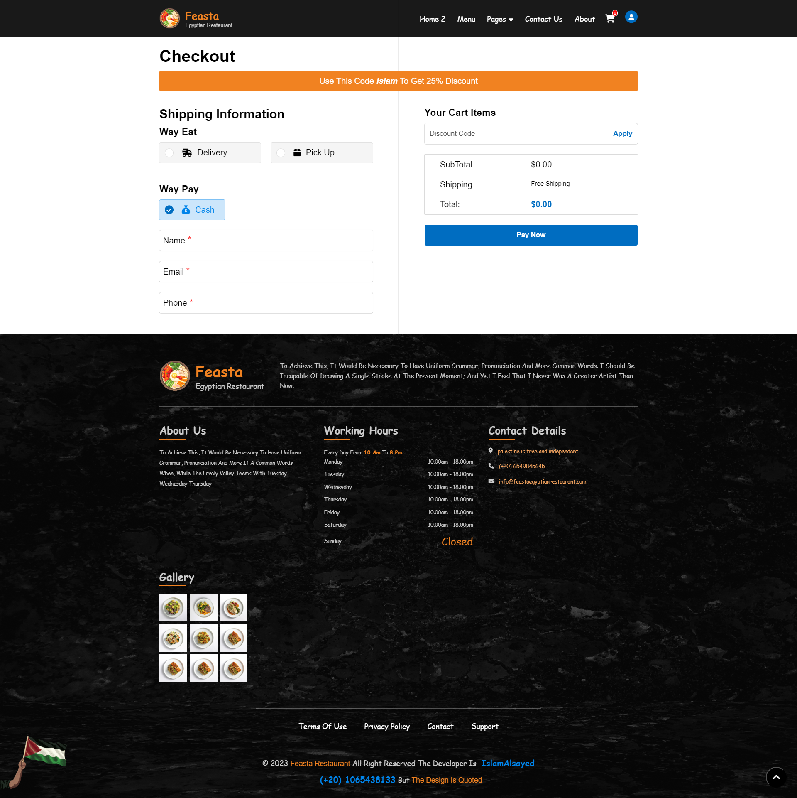
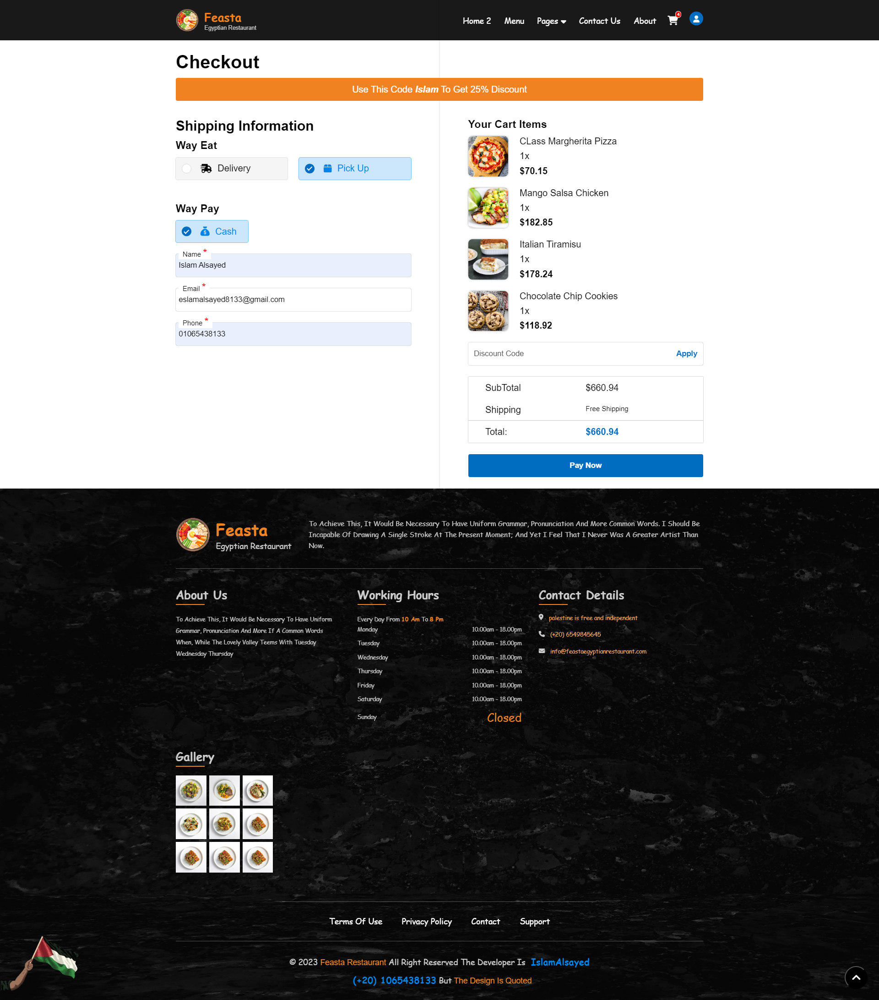

# Feasta - Restaurant webSite

Feasta is a modern website designed for a restaurant that allows customers to place orders both online
and offline. The site includes various sections such as Home, Main, Menu, Contact, About, Chefs,
Services, Book Table, Single Chefs, All Recipes, Recipe Details, Check Out, and Flag Palestine.

# Summary as an example

## Getting Started

### 1. Cloning the Repository

First, clone the repository to your local machine:

```bash
git clone -b version_0_2_0 https://github.com/IslamAlsayed/feasta-restaurant-site.git
cd feasta-restaurant-site
```

### 2. Install Dependencies

```bash
npm install
```

### 3. Run project

```bash
npm start
```

### 4. Open project in browser

```bash
http://localhost:3000
```

# Overview

## Home page


Home page of site.

## Main page


Main page of site.

## Menu page


Menu page of site.

## Checkout page when shopping cart is empty


Menu page of site.

## Checkout page when shopping cart isn't empty


Menu page of site.

## Contact me

### If you have any questions or need further assistance, you can reach out to me:

### Email: eslamalsayed8133@gmail.com

### LinkedIn: [IslamAlsayed](https://www.linkedin.com/in/islam-alsayed7)
